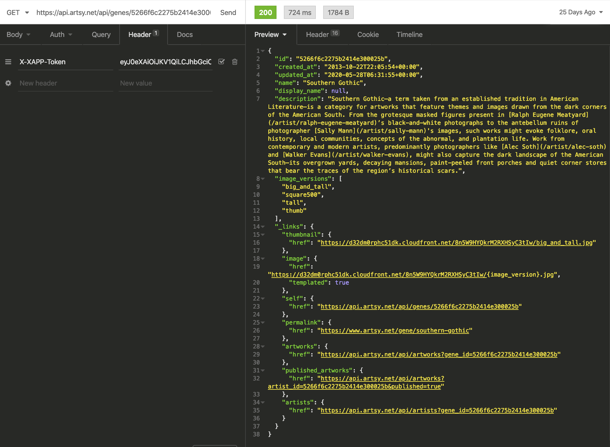
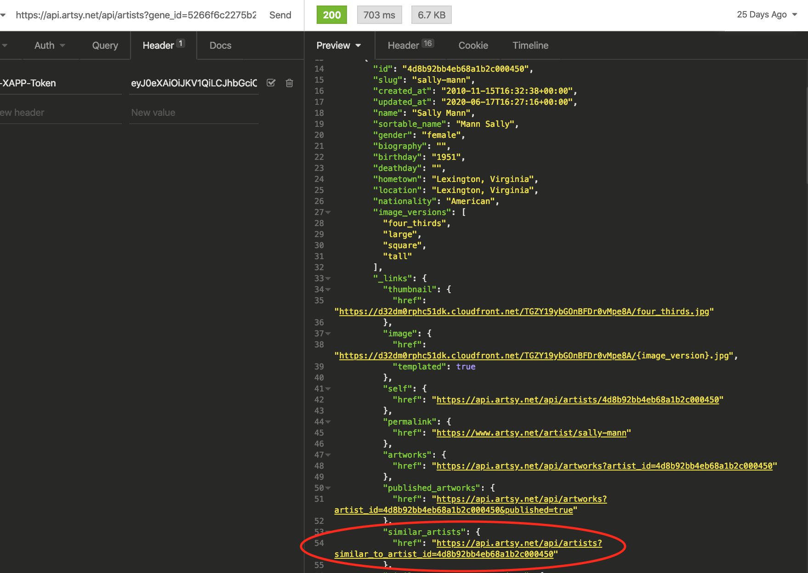
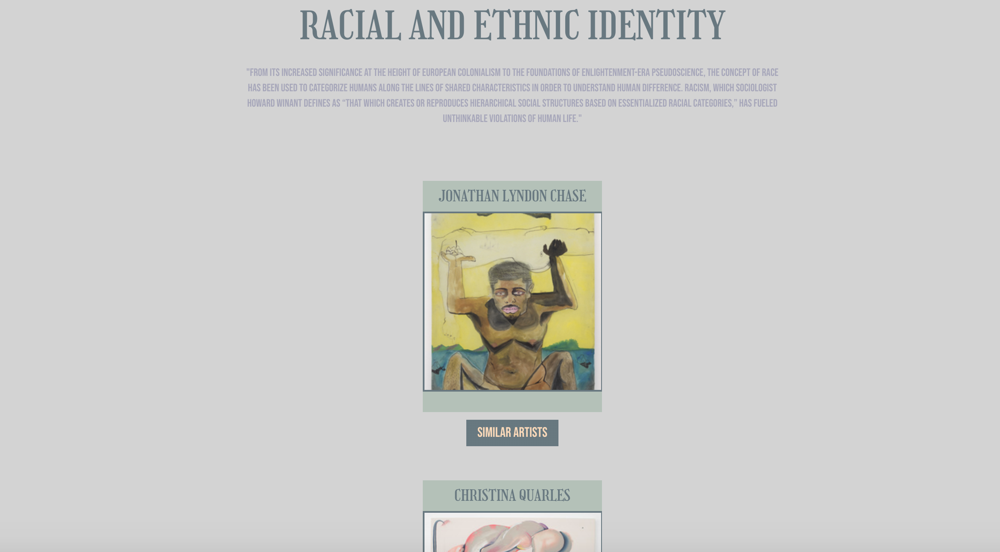
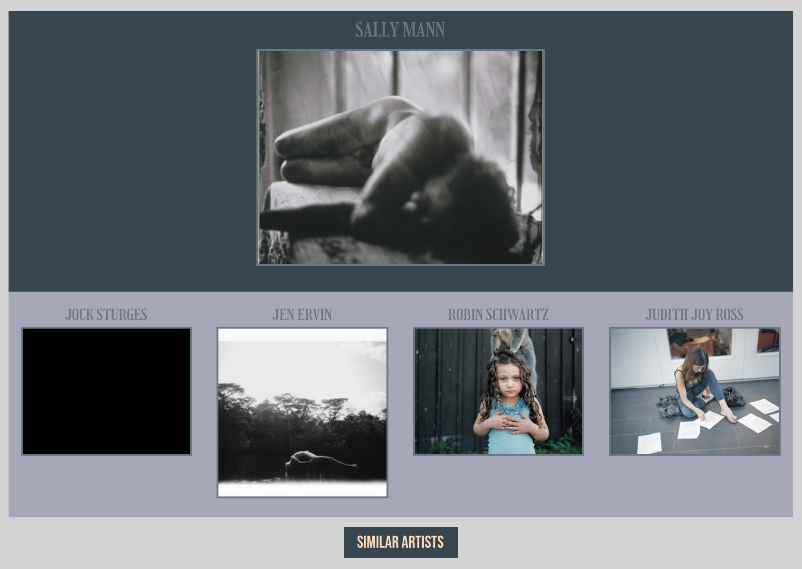
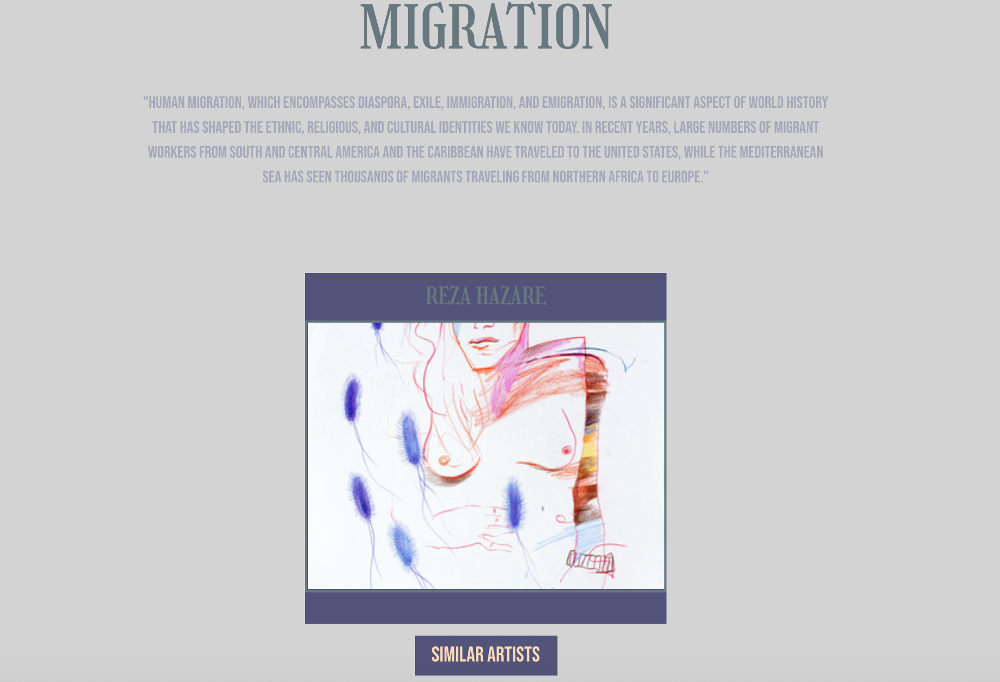

# PROJECT 2 - /TITLED 

By [Kianna Love](https://github.com/akirakianna) and [Raquel Cruickshank](https://github.com/cruickshankrpc)

## Overview

This was my second project, but my first Hackathon at General Assembly. The goal was to build a React (single page) application which consumes a public API. It was to be built in paired teams and be completed within 48 hours.

You can find our deployed project online here: [/TITLED](https://kianna.love/TITLED/#/)

## Table of Contents

1. [Project Brief](#Project-Brief)
2. [Technologies Used](#Technologies-Used)
3. [Approach](#Approach)
    - [Thought Process](#Thought-Process)
    - [Day 1](#Day-1)
    - [Day 2](#Day-2)
4. [Challenges](#Challenges)
5. [Victories](#Victories)
6. [Bugs](#Bugs)
7. [Lessons Learned](#Lessons-Learned)
8. [Future Features](#Future-Features)
9. [Credit](#Credit)

## Project Brief

The project must:

 - Consume a public API.
 - Have several components.
 - The app should include a router with several pages.
 - Include wireframes - designed before building the app.
 - Have semantically clean HTML.
 - Be deployed online.

## Technologies Used

- HTML
- CSS/ SASS
- JavaScript
- React.js
- Insomnia
- Public API - Artsy

## Approach

### Thought Process

We wanted to build an application which created a spotlight for artists of colour and artists whose work surrounds social issues and ethnic diversity.

We chose Artsy as their website includes a diverse range of modern and historic artworks that are currently for sale.
Their API documentation offered us several different endpoints that we could use, but it was quite tricky trying to find a way to display the specific information we wanted. 

We chose an endpoint called Genes, as it allowed us to display data from specific collections on their website. These collections included artwork relevant to our focus.

This endpoint let us display five artists at a time from the chosen collection. We utilised Insomnia to check exactly what information would be returned:




Within this endpoint we could also return each artist's own information and realised that we could access their similar artists (another list of up to 5 artists) although it was nested.



We envisioned displaying the initial 5 artists as cards on our page which would have a button component underneath, that when clicked would show the related similar artists. 


### Day 1

As we only had 2 days, we had to precisely plan out what we wanted to achieve and how would would approach the build.

- Step 1 - Find, and select a public API to use (*see above*).
- Step 2 - Work out how to use it, and what information it returns.
- Step 3 - Plan out our MVP.
- Step 4 - Build our MVP.
- Step 5 - Bug fixing and additonal features/ stretch goals.
- Step 6 - Styling.
- Step 7 - Code refactor.

We decided that our MVP would be a single page application consiting of a home page (including a section spotlighting a specific artist), an about page, a nav bar and a feature collection page with the 5 artists.

Our stretch goals would be to also return similar artists for each artist, and have multiple collection pages.

We had initially aimed to have started building our application on day 1 (step 4), but had quite a lot of problems finding an API which worked and had some semblance of the type of data we wanted to return. 

We didn't actually start writing our code until day 2.

### Day 2

#### App Component

We began by first deciding on the different components we would need:

- NavBar.js [Site navigation]
- HomePage.js [Home]
- RandEI.js [Featured collection - Racial and Ethnic Identity]
- About.js [About our project]

Each section of the application would be stored in its own component and imported into our App.js file.

```
import HomePage from './components/HomePage'
import RandEI from './components/RandEI'
import MigrationArtists from './components/Migration'
import SouthernGothic from './components/SouthernGothic'
import NavBar from './components/NavBar'
import About from './components/About'
```

We used React Router to navigate between the components.

```js
const App = () => {

  return <HashRouter>
    <NavBar />
    <Switch>
      <Route exact path="/" component={HomePage} />
      <Route exact path="/randei" component={RandEI} />
      <Route exact path="/migration" component={MigrationArtists} />
      <Route exact path="/sg" component={SouthernGothic} />
      <Route exact path="/about" component={About} />
    </Switch>
  </HashRouter>
}


export default App

```

#### Home Page Component

Our home page gave us a chance to experiment with some fun React libraries combined with CSS/SASS styling. We installed React Scroll Magic and to create a simple fade in animation utilised keyframes for our typewriter animation.


#### Racial and Ethnic Identity Component

This component is where we have used the Artsy API to both return and display the needed information.

In order to do this, we made use of the useEffect hook - a hook which allows you to perform side effects inside of a function component. In this case we are calling our useEffect() inside of a function component called Artists :

```js
const Artists = () => {

  const [artistsData, setArtistsData] = useState([])

  useEffect(() => {
```
An example of a side effect, and the side effect used in this case, is data fetching.

In order to retrieve the information from the API, we needed to make a fetch request. This fetch function is a promise (an object with the option to resolve or reject - it resolves when the information has been returned): 

```js
 useEffect(() => {
    fetch('https://api.artsy.net/api/artists?cursor=100%3A5ee9c1c34ed9d50007d748b9&gene_id=4de93fa9c182420001004327', { headers: { 'X-XAPP-Token': `${token}` } })
      .then(resp => resp.json())
      .then(data => {
        const newData = data._embedded.artists.map((artist) => {
          return { ...artist, showSimilarArtist: false }

        })

        setArtistsData(newData)

      })
  }, [])
 
```
 
By placing empty [ ] before the closing parentheses assures the function will only run when the component loads. If you didn't have this, it would make the request infinitely.

The .then() functions will not run until the promise is resolved - they are methods on the promise object.
The first argument will always be the last thing returned in the chain. 

In order to have the information display on our page we had to map over the response given in the fetch request.

From there we could access the requested information we wanted to display on our page:

```js
 {artistsData.map((artist, index) => {
        return <div key={index}>
          <Controller>
            <Scene triggerHook={'onEnter'} classToggle="fadeInUp">
              <div className="artistCard">
                <h2 className="artistsName">{artist.name.toUpperCase()}</h2>
                
              </div>
            </Scene>
          </Controller> ...
```
          
 
 

 
##### Similar Artists Functionalitiy
 
I took the lead on the main functionality of our Artist Collection pages (although we pair programmed for solving the duplication issue). As one of our stretch goals we decided to display the similar artists for each artist already on the page. I created a button underneath each artist which would show these similar artists when clicked. 

```
<button className="button-2" key={index} id={artist.id} value={artist._links.similar_artists.href} onClick={() => displaySimilar(event, index)}>Similar Artists</button>
```


This required additonal functionality, which was slightly complex as there were a few different things that needed to happen:

- Accessing the nested data.

I retrieved the data by storing the nested href as the button's value. I also set the button's id to be the artist id - [see above].
This allowed me to fetch the similar artist's data from the button's value once clicked:

```js
 const id = event.target.id
      fetch(event.target.value, { headers: { 'X-XAPP-Token': `${token}` } })
```

- Not displaying duplicates (pair programmed). 

In order to check for duplicates we first had to combine our two arrays, our similarArtists array and our newSimilarArtists:
```js
const combinedArtists = similarArtists.concat(newSimilarArtists)
```
From here we created an empty array (result) and an empty object (artistExists). We then looped through each artist in the combinedArtists array to check whether that artist already had a property called artist.id on it:

```js
combinedArtists.forEach((artist) => {
            if (!artistExists.hasOwnProperty(artist.id)) {
              result.push(artist)
              artistExists[artist.id] = true
            }
          })
```
If it does, this code won't run. However, if it doesn't we push the artist to our result array before updating artistExists to be true so we can't add that artist to the result array again.

- Option to 'hide' the similar artists when the user clicks the button a second time.

When the button has been clicked (and we know if it has already been clicked from state) the state is set to be empty, so that there is nothing to display:

```js
if (buttonKey === key) {
      setSimilarArtists([])
```


I created a function called ``displaySimilar()`` which would handle all of this functionality:

```js
function displaySimilar(event, buttonKey) {
    if (buttonKey === key) {
      setSimilarArtists([])
    
    } else {
      const id = event.target.id
      fetch(event.target.value, { headers: { 'X-XAPP-Token': `${token}` } })
        .then(resp => resp.json())
        .then(data => {
         const newSimilarArtists = data._embedded.artists.map((similarArtist) => {
         return { ...similarArtist, originalArtistID: id }
       })
       const combinedArtists = similarArtists.concat(newSimilarArtists)
       const result = []
       const artistExists = {}
       combinedArtists.forEach((artist) => {
          if (!artistExists.hasOwnProperty(artist.id)) {
             result.push(artist)
             artistExists[artist.id] = true
            }
          })
          setKey(buttonKey)
          setSimilarArtists(result)
        })
    }
  }
```

After this it was easy to create a couple of additional pages (Southern Gothic and Migration) using the same Artist component and functionality. 






## Challenges

- Finding a suitable public API to work with.
- Nested API endpoints.
- The functionality for the similar artists, especially the section handling duplication [see above].

## Victories

- From a past solo project, I was able to figure out how to write the functionality so you can 'hide' the similar artists card on a second click. [See above]
- Teamwork 
 - This was my first paired project and it was a great experience. We were able to easily combine our ideas and plan out how we wanted to go about our build. We spent the initial stages of the project pair programming (using the driver navigator relationship) to get the intial setup / MVP outline coded, before moving on to working on separate areas. 
- Styling
 - As we were working within the same SCSS file, we had to have excellent communication to avoid conflicts. We had a lot of fun with the colour scheme and making our application's UI visually appealing. 

## Bugs
- Animation bugs, the fade in scroll animation on feature pages shudders at points.
- Not a bug, but the code still needs some refactoring - specifically we are currently repeating the same code in 3 components.
- Need to write a refresh token function as currently have to manually update the token, meaning sometimes when you visit our site no artist images will be displayed. **[FIXED]** by using React's Context API and creating a custom provider (ApiProvider) which includes our API auth post request and refresh function, and then passes our token down to the components we wrapped it around in our App component. 


## Lessons Learned
- Design with mobile first in mind.  
- Plan ahead for API selection - we spent too long trying to find one that would work with our general idea.
- We also learned the complexity of using and accessing specific information from public APIs. 

## Future Features

- Fully responsive (currently not responsive).
- Similar artist links for each of the similar artists linked (continued accordion effect).

## Credit

[Artsy API](https://developers.artsy.net/)

All images of artwork and the descriptions about the collections are from [Artsy](https://www.artsy.net/)
 

